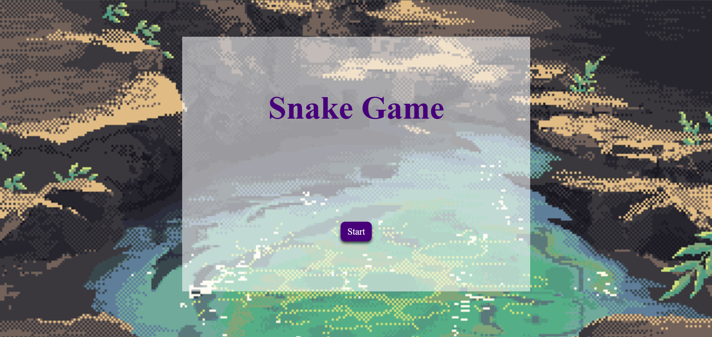
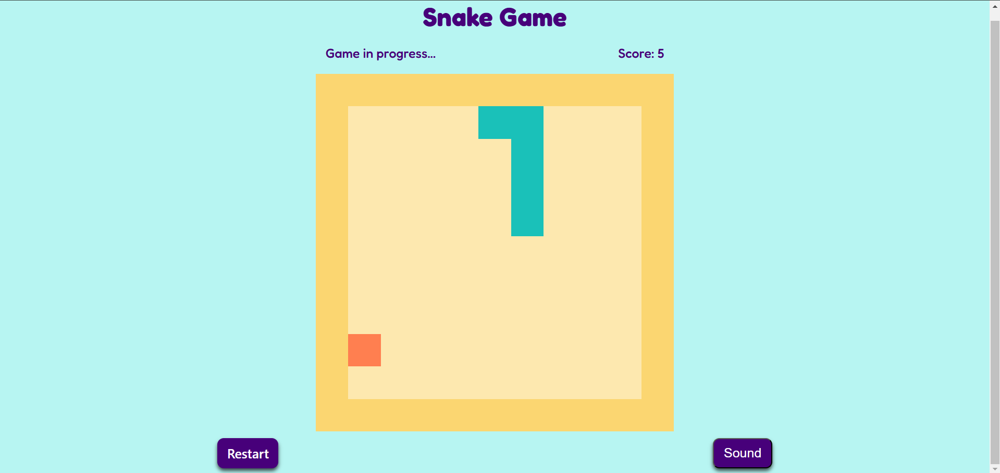

# Snake Games

## Game Description

**Bringing the classic Snake game to life with JavaScript!**
Control the **slithering serpent** with keyboard arrows and **feed it as much as possible**. The longer your snake grows, the higher your score! You've got to avoid **hitting walls** or **your own tail**, or it's **game over.** Are you able to survive for a **long time** and **_score high?_** Let's find out!.
I chose this game because it brings back memories of my childhood when I used to play it on my grandfathers's phone.

## Game Link

[Click to play](https://bumpy-lamp.surge.sh/)

> You can play the game through the above link

## Sound Library

For the game sound/ music I downloaded the music from the source [check it out!](https://opengameart.org/content/eye-of-the-storm).To add the sound in the game script Howler library is utilized. JavaScript library **Howler**.js provides audio management functionality in web applications. The player supports cross-browser playback, volume adjustments, audio sprites, and spatial audio. It is ideal for games, media players, and interactive websites because it is lightweight and efficient.

## List of Technologies Used

- JS.
- CSS.
- HTML.

## Future Enhancments

- Save user high score.
- Add different themes to choose from.
- Add sound effects when snake eats or grows.
- Increase speed in hard mode.
- Let the user choose from maps.
